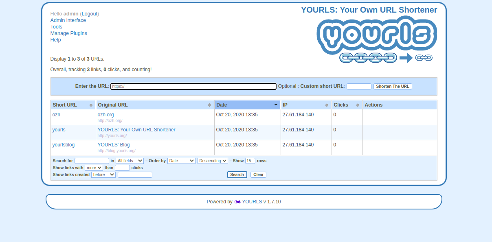

<!--
Ohart ongi: README hau automatikoki sortu da <https://github.com/YunoHost/apps/tree/master/tools/readme_generator>ri esker
EZ editatu eskuz.
-->

# Yourls YunoHost-erako

[](https://ci-apps.yunohost.org/ci/apps/yourls/)


[](https://install-app.yunohost.org/?app=yourls)

*[Irakurri README hau beste hizkuntzatan.](./ALL_README.md)*

> *Pakete honek Yourls YunoHost zerbitzari batean azkar eta zailtasunik gabe instalatzea ahalbidetzen dizu.*  
> *YunoHost ez baduzu, kontsultatu [gida](https://yunohost.org/install) nola instalatu ikasteko.*

## Aurreikuspena

YOURLS stands for Your Own URL Shortener. It is a small set of PHP scripts that will allow you to run your own URL shortening service (a la TinyURL or bitly).
Running your own URL shortener is fun, geeky and useful: you own your data and don't depend on third-party services. It's also a great way to add branding to your short URLs, instead of using the same public URL shortener everyone uses.

### Features

- Private (your links only) or Public (everybody can create short links, fine for an intranet)
- Dozens of plugins to easily implement new features
- Handy bookmarklets to easily shorten and share links
- Awesome stats: historical click reports, referrers tracking, visitors geo-location
- Developer API to integrate YOURLS into other applications
- Sample files to create your own public interface


**Paketatutako bertsioa:** 1.9.2~ynh6

**Demoa:** <https://yourls.org/cookie+>

## Pantaila-argazkiak



## Dokumentazioa eta baliabideak

- Aplikazioaren webgune ofiziala: <https://yourls.org/>
- Administratzaileen dokumentazio ofiziala: <https://docs.yourls.org/>
- Jatorrizko aplikazioaren kode-gordailua: <https://github.com/YOURLS/YOURLS>
- YunoHost Denda: <https://apps.yunohost.org/app/yourls>
- Eman errore baten berri: <https://github.com/YunoHost-Apps/yourls_ynh/issues>

## Garatzaileentzako informazioa

Bidali `pull request`a [`testing` abarrera](https://github.com/YunoHost-Apps/yourls_ynh/tree/testing).

`testing` abarra probatzeko, ondorengoa egin:

```bash
sudo yunohost app install https://github.com/YunoHost-Apps/yourls_ynh/tree/testing --debug
edo
sudo yunohost app upgrade yourls -u https://github.com/YunoHost-Apps/yourls_ynh/tree/testing --debug
```

**Informazio gehiago aplikazioaren paketatzeari buruz:** <https://yunohost.org/packaging_apps>
