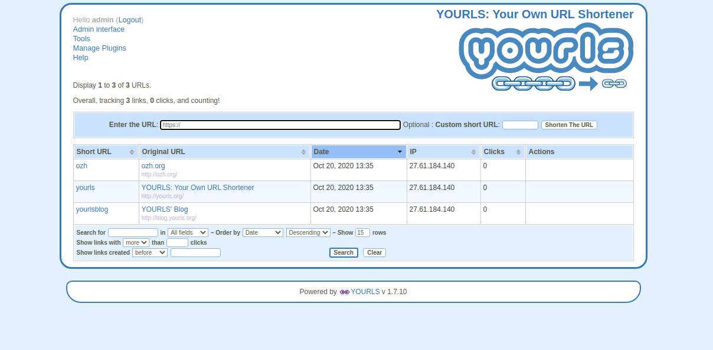

<!--
N.B.: Questo README è stato automaticamente generato da <https://github.com/YunoHost/apps/tree/master/tools/readme_generator>
NON DEVE essere modificato manualmente.
-->

# Yourls per YunoHost

[](https://dash.yunohost.org/appci/app/yourls)  

[](https://install-app.yunohost.org/?app=yourls)

*[Leggi questo README in altre lingue.](./ALL_README.md)*

> *Questo pacchetto ti permette di installare Yourls su un server YunoHost in modo semplice e veloce.*  
> *Se non hai YunoHost, consulta [la guida](https://yunohost.org/install) per imparare a installarlo.*

## Panoramica

YOURLS stands for Your Own URL Shortener. It is a small set of PHP scripts that will allow you to run your own URL shortening service (a la TinyURL or bitly).
Running your own URL shortener is fun, geeky and useful: you own your data and don't depend on third-party services. It's also a great way to add branding to your short URLs, instead of using the same public URL shortener everyone uses.

### Features

- Private (your links only) or Public (everybody can create short links, fine for an intranet)
- Dozens of plugins to easily implement new features
- Handy bookmarklets to easily shorten and share links
- Awesome stats: historical click reports, referrers tracking, visitors geo-location
- Developer API to integrate YOURLS into other applications
- Sample files to create your own public interface


**Versione pubblicata:** 1.9.2~ynh4

**Prova:** <https://yourls.org/cookie+>

## Screenshot



## Documentazione e risorse

- Sito web ufficiale dell’app: <https://yourls.org/>
- Documentazione ufficiale per gli amministratori: <https://docs.yourls.org/>
- Repository upstream del codice dell’app: <https://github.com/YOURLS/YOURLS>
- Store di YunoHost: <https://apps.yunohost.org/app/yourls>
- Segnala un problema: <https://github.com/YunoHost-Apps/yourls_ynh/issues>

## Informazioni per sviluppatori

Si prega di inviare la tua pull request alla [branch di `testing`](https://github.com/YunoHost-Apps/yourls_ynh/tree/testing).

Per provare la branch di `testing`, si prega di procedere in questo modo:

```bash
sudo yunohost app install https://github.com/YunoHost-Apps/yourls_ynh/tree/testing --debug
o
sudo yunohost app upgrade yourls -u https://github.com/YunoHost-Apps/yourls_ynh/tree/testing --debug
```

**Maggiori informazioni riguardo il pacchetto di quest’app:** <https://yunohost.org/packaging_apps>
